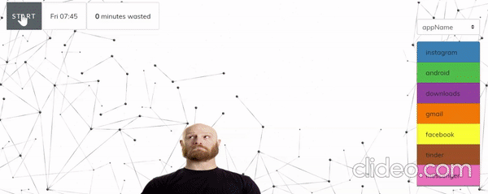
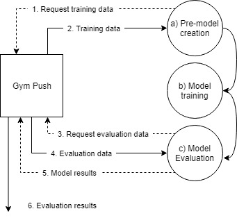
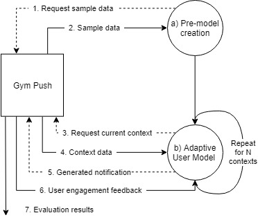
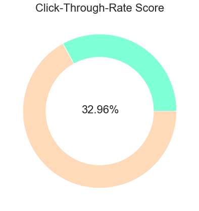
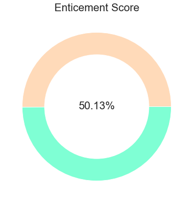
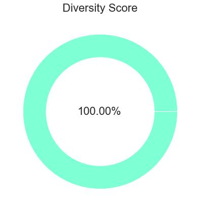
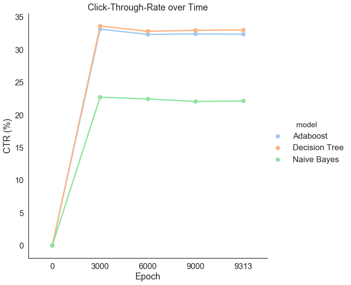
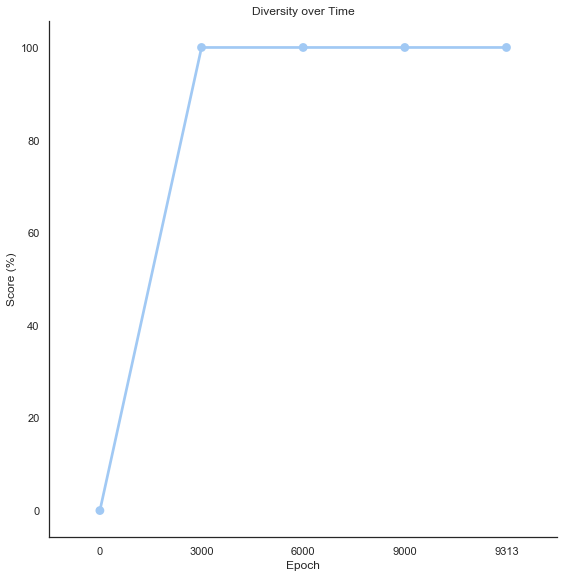
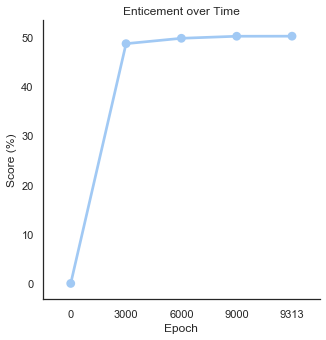

# **Gym-push**
<p align="center">
  
</p>

<p align="center" style="padding-left:20%;padding-right:20%">
  On average we receive ~80 push-notifications a day. This is illustrated above using notifications captured <i>in-the-wild</i>. All are distracting. The majority provide no value to the context and are dismissed. <strong>How can we improve this user experience?</strong>
</p>

## A Custom OpenAI Gym Environment for Intelligent Push-notifications

>To compete in the challenge you need to:
> - (1) Register [here](https://docs.google.com/forms/d/e/1FAIpQLSfZ8ZgIq_FGkcyypmkmdI0NC-6vuKFbzAaK8WgkkrJl2POtcg/viewform?vc=0&c=0&w=1)
> - (2) Sign up to the EvalUMAP [Google Group](https://groups.google.com/forum/#!forum/evalumap) for updates
><br><br>After you register you will receive an email with details on getting started with the challenge.
>Queries can be directed to the [Google Group](https://groups.google.com/forum/#!forum/evalumap) OR evalumap@adaptcentre.ie

#### Content:
1. [Quick start](#Quick-start)
2. [Running basic environment](#Running-basic-environment)
3. [EvalUMAP Challenge 2020](#EvalUMAP-Challenge-2020) 
4. [Task description](#Task-description)
5. [Data explained](#Data-explained)
6. [Running task 1](#Running-task-1)
7. [Running task 2](#Running-task-2)
8. [Submitting results from gym-push](#Submitting-results-from-gym-push)
9. [Submitting your Results Overview paper](#Submitting-your-Results-Overview-paper)
10. [Contact details](#Contact-details)


## Quick start

In order to get started quickly, we recommend briefly reading OpenAI's Gym [documentation](https://gym.openai.com/) and installing [Anaconda](https://docs.anaconda.com/anaconda/install/). Once Anaconda is installed, download our [environment.yml](https://raw.githubusercontent.com/kieranfraser/gym-push/master/environment.yml) and install using the following command (from Anaconda [documentation](https://docs.conda.io/projects/conda/en/latest/user-guide/tasks/manage-environments.html#creating-an-environment-from-an-environment-yml-file)):

```sh
> conda env create -f environment.yml
```
> If an SSL error occurs ensure that Anaconda3, Anaconda3\scripts and Anaconda3\Library\bin are added to PATH

The environment name is *push*. You can activate by executing the following command:
```
(Windows)
> activate push

(Linux and macOS)
> source activate push
```

Once you have installed and activated the *push* environment, execute the following to install *Gym-push*:
```sh
> pip install gym-push
```

We demonstrate examples using [Jupyter Notebooks](https://jupyter.readthedocs.io/en/latest/tryjupyter.html#id1), but you may use any technology stack you wish, once it is able to interface with Gym-push. The examples are:
- [Basic Problem Visualisation](docs/Example_basic-v0.ipynb)
- [Task 1 Example](docs/Example_evalumap1-v0.ipynb)
- [Task 2 Example](docs/Example_evalumap2-v0.ipynb)


> Note Only tested using versions: pip==19.2.3 python==3.6
>> 


## Running basic environment
The *basic-v0* environment simulates notifications arriving to a user in different contexts. The features of the context and notification are simplified. 

Below is an example of setting up the basic environment and stepping through each moment (context) a notification was delivered and taking an action (open/dismiss) upon it. For demonstration purposes, this *agent* randomly samples an action from the action_space. Intelligent agents will use the features of the context and notification to identify optimal performance over time.

Agent performance is evaluated by comparing the action chosen with the *groundtruth* action and monitoring the subsequent *Click-Through-Rate* of notifications.
```sh
import gym
env = gym.make('gym_push:basic-v0')
obs = env.reset()
finished = False
total_reward = 0
while not finished:
	obs, reward, finished, info = env.step(env.action_space.sample())
	total_reward = total_reward + reward
	env.render()
print('Total Reward: ', total_reward)
```
The output of executing above code:
<p align="center">
  
</p>

## EvalUMAP Challenge 2020
The use-case for this challenge is personalized mobile phone notification generation. Previous work in this space has explored intercepting incoming mobile notifications, mediating their delivery such that irrelevant or unnecessary notifications do not reach the end-user and generating synthetic notification datasets from real world usage data. The next step toward an improved notification experience is to generate personalised notifications in real-time, removing the need for interception and delivery mediation. 

Specifically, assuming individuals’ interactions with their mobile phone have been logged, the challenge is to create an approach to generate personalized notifications on individuals’ mobile phones, whereby such personalization would consist of deciding what events (emails, alerts, reminders etc.) to show to the individual and when to show them. Given the number of steps associated with such personalization, the task proposed will focus on the first step in this process, that of user model generation using the logged mobile phone interactions. For this task a dataset consisting of several individuals’ mobile phone interactions is provided, described [here](#Data-explained).

#### Important Dates

|Date|Description|
|-------------|-----------------------------|
|31st October 2019| Task registration open|
|31st October 2019| Training data released|
|28th Feb. 2020| User-model development freeze (no further changes allowed) & submission of developed user-model|
|1st March 2020| Test data release|
|15th March 2020| Evaluation lab closes; participants submit their results on the test data|
| **April 2020** | Participants submit their results overview papers|
| *Date tbc (by UMAP)* | Notification of acceptance|
| *Date tbc (by UMAP)* | Camera-ready paper submission deadline|
|July 2020| Evaluation Track runs at UMAP 2020|

## Task Description
#### Task 1
<p align="center">
  
</p>

The diagram above illustrates the operation flow for Task 1. 

Participants query *gym-push* for 3 months of historical data. Using this data, the participants should create a user model which takes a context (e.g. Time: 'morning', Place: 'airport', etc.) as input and outputs a personalized notification (e.g. App: 'news', Subject: 'weather', etc.) for the given context. Gym-push can be used for training purposes by returning performance metrics for notifications generated using the training contexts.

Once the model is built, it can be evaluated, again using gym-push. This is achieved by requesting *test* data, 3 months of contextual evaluation data, from gym-push. Resulting notifications generated should then be returned to the environment where evaluation metrics are calculated using test assets.


#### Task 2
<p align="center">
  
</p>

The diagram above illustrates the differing operation flow for Task 2. Participants are asked to create a user model based on the same notification, context and engagement features - but without historical notification data to train with (although, they can query the environment for sample data with which to create their model). 

In contrast to Task 1, this user model will need to query the gym-push environment at each step to receive a current context feature and a previous user notification-engagement feature. As the environment steps through each context item and as engagement history becomes available, the user model can exploit this information to improve the generation of personalized notifications.

The goal is to develop a model which adapts and learns how to generate personalized notifications in real-time, without prior history of the user (cold-start problem). Evaluation is continuous for this task and a summary of results is issued once all context features have been processed.

## Data explained
The data can be broken down into three subsets: notifications, contexts and engagements. When training, the request_data() method will return all three subsets of data in three separate DataFrames. When testing, the request_data(test=True) method will return one DataFrame containing just context data.

#### Notifications contain the following features:

|Feature|Data type|Explanation|
|-------------|-----------------------------|-------------------|
|appPackage|object|The app that sent the notification|
|category|object|The category of the notification, possible values include: 'msg' and 'email'|
|ledARGB|object|The color the LED flashes when a notification is delivered|
|priority|object|The priority level of the notification set by the sender|
|vibrate|object|The vibration pattern which alerts the user of the notification on arrival|
|visibility|object|The visibility level of the notification, possible values include: 'secret', 'private' and 'public'|
|subject|object|The subject the notification text content was inferred to be|
|enticement|object|The enticement value the notification text content was inferred to have|
|sentiment|object|The sentiment value the notification text content was inferred to have|

#### Contexts contain the following features:

|Feature|Data type|Explanation|
|-------------|-----------------------------|-------------------|
|timeOfDay|object|The time of day split into buckets, possible values: 'early-morning', 'morning', 'afternoon', 'evening', 'night'|
|dayOfWeek|object|The day of week|
|unlockCount_prev2|int64|The number of times the user has unlocked their device in the preceding two hours|
|uniqueAppsLaunched_prev2|int64|The number of unique apps the user has opened in the preceding two hours|
|dayOfMonth|int64|The day of the month|

#### Engagements contain the following features:

|Feature|Data type|Explanation|
|-------------|-----------------------------|-------------------|
|action|int64|The action taken by the user on a notification in a given context, possible values: 1 (opened), 0 (dismissed)|

## Running task 1
A [Jupyter Notebook](docs/Example_evalumap1-v0.ipynb) is provided in the docs folder demonstrating how to set up the relevant environment for this task and interact with it. The following is a brief extract from it illustrating a random model being evaluated:

```sh
import gym
import pandas as pd

env = gym.make('gym_push:evalumap1-v0')

training_contexts, training_notifications, training_engagements = env.request_data()

random_notifications = [env.action_space.sample() for context in training_contexts.values]
random_notifications = pd.DataFrame(random_notifications)

env.evaluate(random_notifications)
```
When run, results should approximate:
```sh
[{'model': 'Adaboost', 'ctr_score': 31.590250187909376}, {'model': 'Decision Tree', 'ctr_score': 33.35122946418984}, {'model': 'Naive Bayes', 'ctr_score': 21.754536669172126}, {'metric': 'diversity_score', 'score': 100.0}, {'metric': 'enticement_score', 'score': 50.36508106947279}]
```
<p align="center">
       
</p>


## Running task 2
A [Jupyter Notebook](docs/Example_evalumap2-v0.ipynb) is provided in the docs folder demonstrating how to set up the relevant environment for this task and interact with it. The following is a brief extract from it illustrating a random model being evaluated:

```sh
import gym
import pandas as pd

env = gym.make('gym_push:evalumap2-v0')

context = env.reset(test=False, verbosity=3000)
finished = False
epoch = 0

while not finished:
    context, engagement, finished, info = env.step(pd.DataFrame([env.action_space.sample()]))
    
    if epoch%3000==0 and epoch>0:
        print('------------- Epoch: '+str(epoch)+' ------------------')
        print('Latest CTR score', info['ctr'][-len(env.models):][0]['ctr_score'])
        print('Latest Diversity score', info['diversity'][-1]['score'])
        print('Latest Enticement score', info['enticement'][-1]['score'])
        
    epoch += 1
    
```
When run, results should approximate:
```sh
Resetting environment.
Updated results at epoch:  3000
------------- Epoch: 3000 ------------------
Latest CTR score 22.692435854715097
Latest Diversity score 100.0
Latest Enticement score 50.566477840719756
Updated results at epoch:  6000
------------- Epoch: 6000 ------------------
Latest CTR score 22.42959506748875
Latest Diversity score 100.0
Latest Enticement score 50.324945842359604
Updated results at epoch:  9000
------------- Epoch: 9000 ------------------
Latest CTR score 22.041995333851794
Latest Diversity score 100.0
Latest Enticement score 50.083324075102766
Finished. Saving final results at epoch:  9313
```
<p align="center">
       
</p>
<p align="center">
     
</p>
<p align="center">
     
</p>

## Submitting results from gym-push
Submit your model and your results folder via one of the following methods (the first method is preferred):

1. **Github** - Create a repository with your user model and the accompanying results achieved. Comment a link to the repository in the [Google Group](https://groups.google.com/forum/#!topic/evalumap/Gq_5sRQ-L1Y) along with the email you registered with.
2. **Google Group** - Zip your model and training results and attach it to a post in the [Google Group](https://groups.google.com/forum/#!topic/evalumap/Gq_5sRQ-L1Y) along with the email you registered with.

>Your results folder should contain all of the following files for the tasks which you attempted (generated for you by gym-push): 
> <br>**Task 1**: *ctr_pie.png, ctr_results.png, diversity_pie.png, enticement_pie.png, results.joblib*
> <br>**Task 2**: *ctr_final_bar.png, ctr_final_donut.png, ctr_results.joblib, ctr_results.png, diversity_final_donut.png, diversity_results.joblib, diversity_results.png, enticement_final_donut.png, enticement_results.joblib, enticement_results.png*

The validation data will be released on Monday (March 2nd). Models should not be altered once the validation data is released. You should validate your models using this data and update your submission with your models validation results by March 15th. An example of obtaining validation results for both Task 1 and Task 2 is outlined below.

#### Task 1: Obtaining validation results
Simply pass *validation=True* to the *request_data* method to ensure the environment is set to validation mode.
```sh

# 1. Request the validation data
testing_contexts = env.request_data(validation=True)
action_info = env.action_space.info

# 2. Load my model (using random for demonstration purposes)
def gen_rand_notification():
    notification = {}
    for feature in action_info:
        notification[feature] = random.choice(action_info[feature]['labels'].classes_)
    return notification

# 3. Generate notification for each context
random_notifications = [gen_rand_notification() for context in testing_contexts.values]
random_notifications = pd.DataFrame(random_notifications)

#3. Use gym-push to generate validation results
env.evaluate(random_notifications)

```
> On completion, the local address of your validation results is printed to the screen:
> <br>Results saved here:  c:\users\kieran\...\gym-push\gym_push\envs/results/validation/task1/


#### Task 2: Obtaining validation results
Simply pass *validation=True* to the *reset* method to ensure the environment is set to validation mode.

```sh

start = datetime.now()

context = env.reset(validation=True, verbosity=1000)
finished = False

while not finished:
    # Model generates notification (random generation used for demo purposes)
    random_notification = pd.DataFrame([env.action_space.sample()])
    
    # Pass the notification to the environment and get result and next context
    context, engagement, finished, info = env.step(random_notification)
    
end = datetime.now()
time_taken = end - start
print('Time elapsed (h:mm:ss): ', time_taken) 

```
> On completion, the local address of your validation results is printed to the screen:
> <br>Results saved here:  c:\users\kieran\...\gym-push\gym_push\envs/results/validation/task2/


## Submitting your Results Overview paper
Your results overview paper should be max. 6-pages long.  Submissions should be in ACM SIGS format. LaTeX and Word templates are available [here](https://www.acm.org/publications/proceedings-template).
Papers should be submitted in pdf format through the [EasyChair system](https://easychair.org/conferences/?conf=evalumap2020) no later than midnight Pacific Daylight Time on April XX, 2020 *(date to be set by UMAP)*. Submissions will be reviewed by members of the workshop program committee. Accepted papers will be included in the UMAP 2020 EvalUMAP workshop proceedings.

Your paper should include the following:

- Brief description of the EvalUMAP challenge to set context & link to the challenge on GitHub (https://github.com/kieranfraser/gym-push).  
- Description of the technique that you implemented and your main objectives and progress beyond the state-of-the-art if applicable.
- The results you obtained.
- Thoughts on future work.

The following reference for the EvalUMAP challenge description should be included in your paper:

*Conlan, Owen and Fraser, Kieran and Kelly, Liadh and Yousuf, Bilal (2019) A User Modeling Shared Challenge Proposal. In Proceedings of the 10th Conference and Labs of the Evaluation Forum, Lecture Notes in Computer Science (LNCS), Springer, September 2019.*

## Contact details
The following is a list of people who are available to answer queries:

|Name|Email|Regarding|
|-------------|-----------------------------|-------------------|
|Kieran Fraser|kieran.fraser@adaptcentre.ie | Gym-push          |
|Bilal Yousuf |bilal.yousuf@adaptcentre.ie  | EvalUMAP Challenge|
